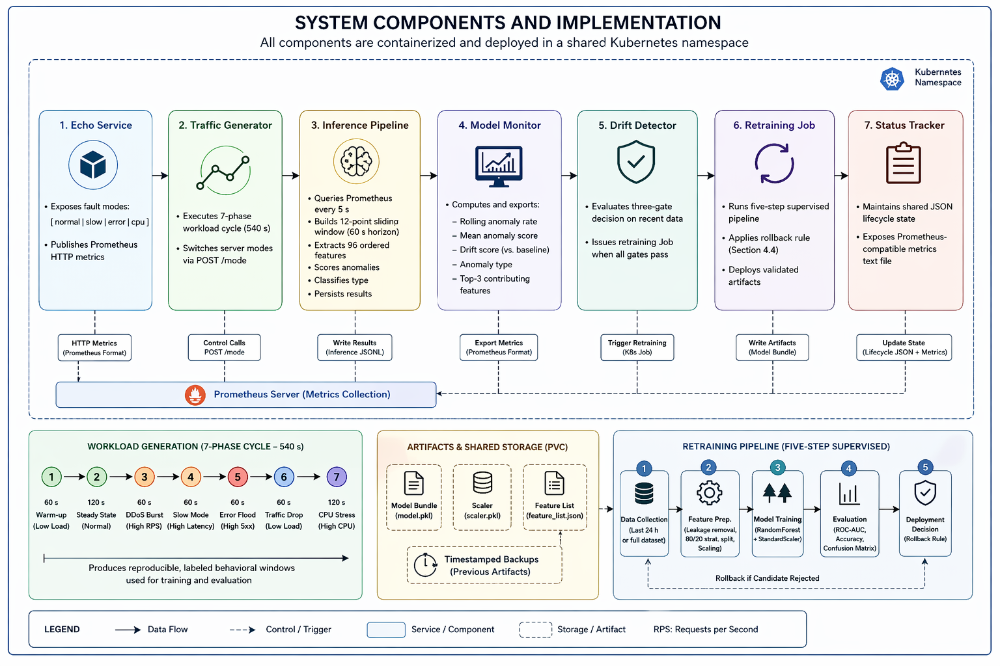
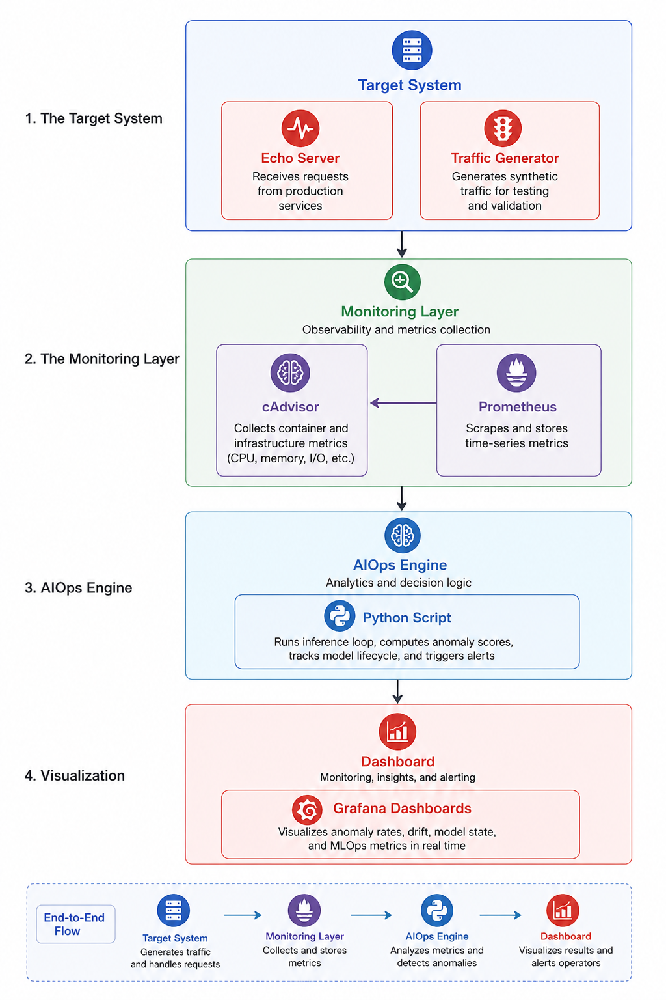
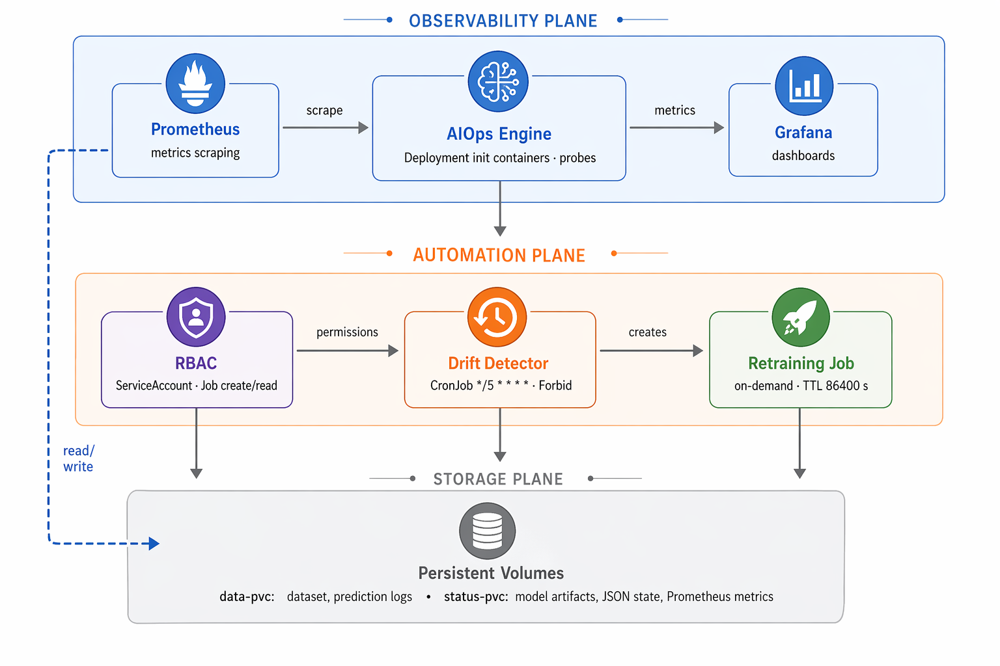
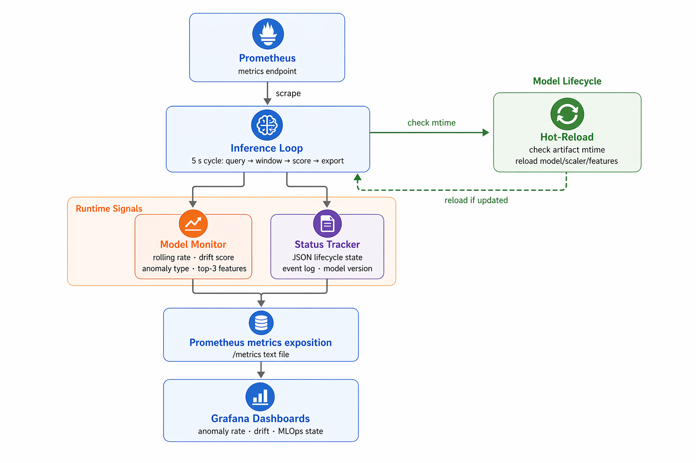
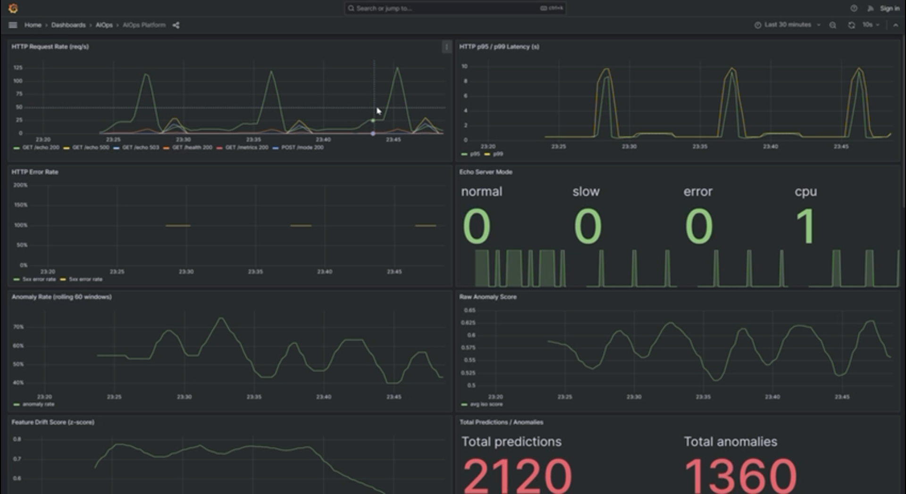
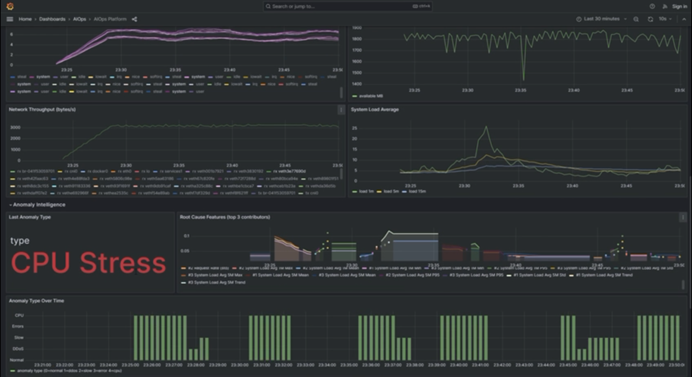
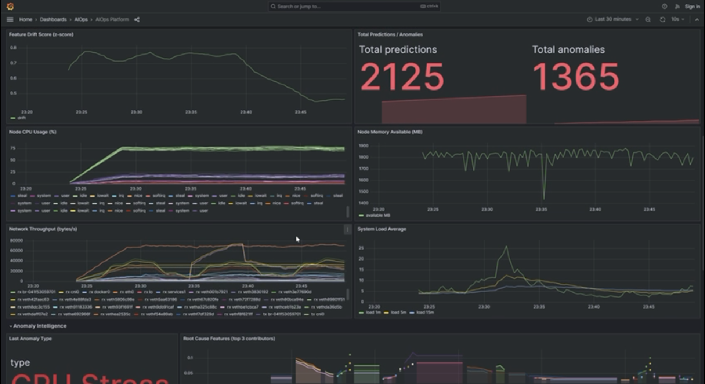
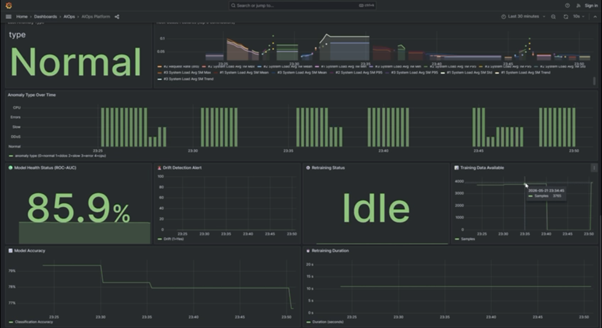
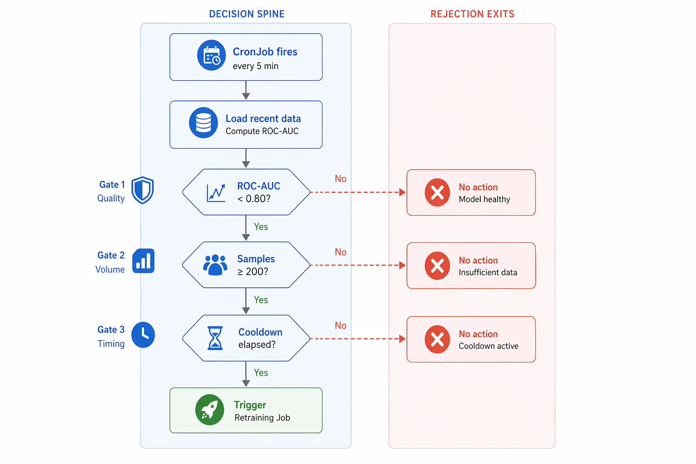
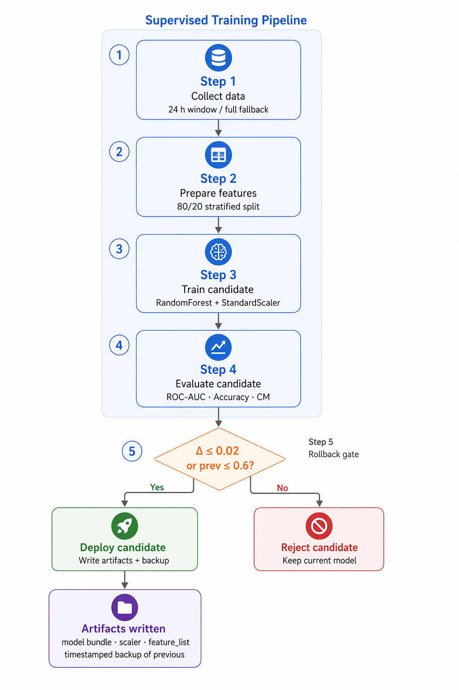

<div align="center">

# AIOps : Anomaly Detection & Auto-Retraining Platform

[](https://python.org)
[](https://kubernetes.io)
[](https://prometheus.io)
[](https://grafana.com)
[](https://scikit-learn.org)
[](https://docker.com)
[](https://locust.io)

**End-to-end MLOps platform that automatically detects anomalies in Kubernetes workloads, monitors model degradation, and continuously triggers retraining, with zero human intervention.**

| Metric                   | Value         |
| ------------------------ | ------------- |
| 🎯 ROC-AUC               | **95.61%**    |
| ✅ Accuracy              | **88.31%**    |
| 📊 Samples collected     | **11,700+**   |
| ⏱️ Inference latency     | **5 seconds** |
| 🔄 Drift detection cycle | **5 minutes** |

</div>

---

## 📋 Table of Contents

1. [Skills Demonstrated](#-skills-demonstrated)
2. [System Architecture](#-system-architecture)
3. [Tech Stack](#-tech-stack)
4. [Key Features](#-key-features)
5. [Platform in Action](#-platform-in-action)
6. [Quick Start](#-quick-start)
7. [Project Structure](#-project-structure)
8. [Drift Detection & Auto-Retraining](#-drift-detection--auto-retraining)
9. [Feature Engineering (96 Dimensions)](#-feature-engineering-96-dimensions)
10. [Monitoring & Verification](#-monitoring--verification)
11. [Useful Commands](#-useful-commands)
12. [Problems Encountered & Solutions](#-problems-encountered--solutions)
13. [Author](#-author)

---

## 🚀 Skills Demonstrated

This project covers the **complete MLOps lifecycle** in a fully containerised environment:

| Domain                   | What is implemented                                                                                      |
| ------------------------ | -------------------------------------------------------------------------------------------------------- |
| **Machine Learning**     | Supervised RandomForest, temporal feature engineering (96 dims), ROC-AUC evaluation, automatic rollback  |
| **MLOps**                | Periodic drift detection, auto-retraining via Kubernetes Job, hot-reload of model without pod restart    |
| **Observability**        | Prometheus (5 s scraping, PromQL alert rules), Grafana (real-time dashboards), custom metrics exposition |
| **Kubernetes**           | Deployments, CronJobs, Jobs, PVC, RBAC, init containers, liveness/readiness probes, resource limits      |
| **Software Engineering** | Microservices architecture, controlled fault injection, streaming data pipeline                          |
| **Advanced Python**      | Sliding window processor, multi-threading, embedded HTTP server, model serialisation                     |

---

## 🏗️ System Architecture

### Platform Overview



The platform is composed of **7 specialised components** running in a single Kubernetes namespace (`aiops`), connected through Prometheus as the central metrics bus. Each component has a single, well-defined responsibility:

| #   | Component              | Role                                                                                                |
| --- | ---------------------- | --------------------------------------------------------------------------------------------------- |
| 1   | **Echo Server**        | Target HTTP application, exposes fault modes (`normal / slow / error / cpu`) and Prometheus metrics |
| 2   | **Traffic Generator**  | Locust load generator, drives the 7-phase cycle, switches fault modes via `POST /mode`              |
| 3   | **Inference Pipeline** | Core ML loop, queries Prometheus every 5 s, extracts 96 features, scores with RandomForest          |
| 4   | **Model Monitor**      | Real-time metrics exporter, rolling anomaly rate, drift score, anomaly type, top-3 features         |
| 5   | **Drift Detector**     | CronJob `*/5 * * * *`, evaluates 3 gates, triggers retraining Job if all pass                       |
| 6   | **Retraining Job**     | On-demand Kubernetes Job, runs the 5-step supervised pipeline, applies rollback gate                |
| 7   | **Status Tracker**     | Maintains shared JSON lifecycle state and Prometheus-compatible metrics text file                   |

---

### Platform Layers



The system is organised in **4 horizontal layers**:

1. **Target System** : Echo Server + Traffic Generator simulate realistic, labelled workloads
2. **Monitoring Layer** : Prometheus + cAdvisor collect and store all time-series metrics (5 s scrape interval)
3. **AIOps Engine** : Python inference loop runs anomaly detection, tracks model lifecycle, and triggers alerts
4. **Visualisation** : Grafana dashboards display real-time anomaly scores, drift trends, and MLOps pipeline state

---

### Kubernetes Infrastructure



The Kubernetes deployment is structured across **3 planes**:

- **Observability Plane** : Prometheus scrapes → AIOps Engine infers → Grafana visualises
- **Automation Plane** : RBAC-controlled ServiceAccount → Drift Detector CronJob → Retraining Job (on-demand, TTL 86 400 s)
- **Storage Plane** : Two PVCs shared across all components:
  - `pipeline-data` (1 Gi, `/data`) : CSV audit trail + retrained model artifacts
  - `aiops-shared` (5 Gi, `/shared`) : `mlops_status.json` lifecycle state + Prometheus metrics text file

---

### Inference Loop & Model Hot-Reload



Every **5 seconds**, the `pipeline.py` inference loop:

1. Queries the Prometheus API (~23 PromQL expressions across 4 metric layers)
2. Feeds the result into the **12-point sliding window** (60 s of history)
3. Extracts **96 statistical features** (mean, std, min, max, p95, trend per raw metric)
4. Scales features with the saved `StandardScaler`
5. Scores with the **RandomForest classifier** → `is_anomaly` + `anomaly_score`
6. Classifies the anomaly type (DDoS / Slow / Error / CPU) from top-3 feature importances × |z-score|
7. Records the result via `ModelMonitor` (rolling rate, drift score, anomaly type)
8. Appends the window to `/data/cleaned_dataset.csv` (every 5 windows)
9. **Checks `mtime`** of the model `.pkl` file, reloads all 3 artifacts (`model`, `scaler`, `feature_list`) if a newer file is detected, without any pod restart

---

## 🛠️ Tech Stack

| Layer                  | Technologies                                                            |
| ---------------------- | ----------------------------------------------------------------------- |
| **ML / Data**          | Python 3.11, scikit-learn (RandomForest, StandardScaler), pandas, NumPy |
| **Infrastructure**     | Kubernetes (Docker Desktop), Docker                                     |
| **Monitoring**         | Prometheus, Grafana, node-exporter, prometheus_client                   |
| **Load Generation**    | Locust (multi-phase load shape, fault injection)                        |
| **Target Application** | Flask, prometheus_client                                                |
| **ML Orchestration**   | Kubernetes CronJob + Job, kubectl (API calls from Python)               |
| **Persistence**        | PersistentVolumeClaims (CSV audit trail + serialised models)            |

---

## ✅ Key Features

### Automated Drift Detection

- **Every 5 minutes**: model performance is evaluated on the most recent data window
- **ROC-AUC threshold: 0.80** : if performance drops below, retraining is triggered
- **Full audit trail**: every check is written to `mlops_status.json` for complete traceability

### Intelligent Auto-Retraining

Retraining is only triggered when **all 3 safety gates pass** simultaneously:

| Gate                 | Condition                  | Env variable                   |
| -------------------- | -------------------------- | ------------------------------ |
| **Drift detected**   | ROC-AUC < threshold        | `DRIFT_THRESHOLD=0.80`         |
| **Sufficient data**  | ≥ 200 samples in last 24 h | `MIN_SAMPLES_FOR_RETRAIN=200`  |
| **Cooldown elapsed** | ≥ 24 h since last retrain  | `MIN_HOURS_BETWEEN_RETRAIN=24` |

### Real-Time Inference

- **5-second end-to-end latency**: metrics collection → feature extraction → prediction → metrics export
- **96 features**: statistical summaries extracted from a 60-second sliding window
- **Root cause analysis**: exposes the top-3 contributing features for every anomaly flag
- **Dual output**: binary classification + probability score, both exported to Prometheus

### Model Rollback

A newly trained model is **automatically rejected** if `ROC-AUC_new < ROC-AUC_previous − 2%` : the previous model stays in production and a timestamped backup is written.

### Production Monitoring

- **Prometheus**: 40+ metric types scraped every 5 s, PromQL alert rules with configurable thresholds
- **Grafana**: real-time visualisation of anomaly scores, types, root-cause features, and MLOps pipeline state
- **Audit trail**: `/shared/mlops_status.json` records every drift check, retraining attempt, and rollback decision

---

## 🖥️ Platform in Action

Four Grafana dashboard screenshots captured during a live run of the 7-phase fault-injection cycle.

### Application Metrics & Anomaly Scoring



HTTP request rate spikes during DDoS phases, p95/p99 latency peaks sharply during slow-client injection, and the rolling anomaly rate tracks the fault cycle in real time. The **Echo Server Mode** panel (bottom-right) confirms which fault mode is currently active, here `cpu = 1`, all others at 0. The Raw Anomaly Score panel shows the RandomForest probability hovering around 0.55–0.65 during the transition.

---

### Real-Time Anomaly Intelligence : CPU Stress Detected



The **Last Anomaly Type** panel switches to **CPU Stress** (displayed in red) as the cpu-spike phase begins. The **Root Cause Features** heatmap highlights the top-3 contributing metrics, all system load averages (1m/5m max, mean, p95), confirming correct root cause attribution. The **System Load Average** chart shows the characteristic spike to ~25, and CPU usage climbs steadily to 75%+.

---

### System Observability : Drift Score & Prediction Counters



The **Feature Drift Score** (z-score) chart tracks distributional shift across the 96-feature space in real time. At this point the platform has processed **2,125 predictions** and flagged **1,365 anomalies** since startup. Node CPU usage, memory available, network throughput, and system load panels provide full host-level infrastructure context alongside the ML metrics.

---

### MLOps Health : Model Status & Retraining Pipeline



**Model Health Status** at **85.9% ROC-AUC**, above the 0.80 drift threshold, so no retraining is triggered. **Retraining Status** is `Idle`. **Training Data Available** shows 3,785 samples currently collected on the PVC. The **Anomaly Type Over Time** bar chart confirms the classifier correctly cycles through all fault types across multiple consecutive 540-second cycles. The **Model Accuracy** panel shows the classification accuracy trend over the last 30 minutes.

---

## ⚡ Quick Start

### Prerequisites

- Docker Desktop with Kubernetes enabled
- `kubectl` configured against the Docker Desktop cluster
- 8 GB RAM minimum recommended

### Deploy in Two Commands

```bash
# 1. Clone the repository
git clone <repo-url>
cd aiops

# 2. Full deployment (Linux/Mac)
./deploy.sh

# Or step by step:
docker build --no-cache -t aiops/aiops-engine:latest  aiops-engine/
docker build -t aiops/echo-server:latest              echo-server/
docker build -t aiops/traffic-gen:latest              traffic-gen/
kubectl apply -f k8s/

# 3. Wait for pods to stabilise (2-3 minutes)
kubectl get pods -n aiops -w

# 4. Open the Grafana dashboard
kubectl port-forward -n aiops svc/grafana 3000:3000
# → http://localhost:3000  (login: admin / admin)
```

### Offline Training Workflow (initial model)

```bash
# Extract data collected by the running pipeline
kubectl exec -n aiops deployment/aiops-engine -- \
  cat /data/cleaned_dataset.csv > data/cleaned_dataset.csv

# Step 1: prepare the labelled dataset
python training/prepare_dataset.py
# → data/training_dataset.csv + training/models/feature_list.json

# Step 2: train the supervised RandomForest
python training/train_model.py
# → training/models/anomaly_detector.pkl + scaler.pkl

# Step 3: bake the new model into the Docker image
cp training/models/* aiops-engine/models/
docker build --no-cache -t aiops/aiops-engine:latest aiops-engine/
kubectl delete pod -n aiops -l app=aiops-engine
```

---

## 📁 Project Structure

```
aiops/
├── README.md
├── assets/                              ← Architecture diagrams
│
├── aiops-engine/                        ← System core (inference + MLOps)
│   ├── pipeline.py                      # Real-time inference loop (5 s)
│   ├── detect_and_trigger_retrain.py    # Drift detection (CronJob every 5 min)
│   ├── auto_retrain_pipeline.py         # Retraining pipeline (K8s Job)
│   ├── model_monitor.py                 # Prometheus exporter (live metrics)
│   ├── mlops_status_exporter.py         # Audit trail (mlops_status.json)
│   ├── Dockerfile
│   ├── requirements.txt
│   └── models/
│       └── feature_list.json            # Ordered list of the 96 expected features
│
├── echo-server/                         ← Target application (Flask + fault injection)
│   ├── app.py                           # Modes: normal / slow / error / cpu
│   ├── Dockerfile
│   └── requirements.txt
│
├── traffic-gen/                         ← Load generator (Locust)
│   ├── locustfile.py                    # 7 phases × 4 user types
│   ├── Dockerfile
│   └── requirements.txt
│
├── training/                            ← Offline training (run locally)
│   ├── prepare_dataset.py               # Step 1: cleaning + labelling
│   ├── train_model.py                   # Step 2: supervised RandomForest
│   └── models/
│       └── feature_list.json
│
├── monitoring/                          ← Analysis scripts (run locally)
│   ├── evaluate_current_model.py        # Evaluation vs ground truth
│   ├── evaluate_recent_only.py          # Evaluation on last 24 h only
│   ├── drift_analysis.py                # Day-by-day degradation analysis
│   └── get_data_for_retraining.py       # Select recent data subset
│
├── k8s/                                 ← Kubernetes manifests (numbered, apply in order)
│   ├── 01-namespace.yaml
│   ├── 02-prometheus-config.yaml        # Scrape config + PromQL alert rules
│   ├── 03-pvc.yaml
│   ├── 04-prometheus.yaml
│   ├── 05-echo-server.yaml
│   ├── 06-traffic-gen.yaml
│   ├── 07-aiops-engine.yaml             # init containers: wait-for-prometheus, etc.
│   ├── 08-node-exporter.yaml
│   ├── 09-grafana.yaml
│   ├── 10-grafana-dashboard.yaml
│   ├── 13-drift-detection-cronjob.yaml  # CronJob + ServiceAccount + RBAC
│   ├── 14-retraining-job.yaml           # Job template triggered by drift detector
│   ├── 15-grafana-mlops-dashboard.yaml
│   └── 16-mlops-config.yaml
│
├── deploy.sh                            ← Full deployment script (Linux/Mac)
├── deploy.bat                           ← Full deployment script (Windows)
├── deploy-mlops-stack.sh                ← MLOps stack only deployment
└── grafana-mlops-dashboard.json         ← Grafana dashboard export
```

---

## 🔄 Drift Detection & Auto-Retraining

### The Three-Gate Decision



Every 5 minutes the `aiops-drift-detection` CronJob evaluates three sequential safety gates. All three must be satisfied before retraining is launched, this prevents thrashing, overfitting on small datasets, and unnecessary compute.

**Gate logic in `detect_and_trigger_retrain.py`:**

```python
# Gate 1: quality
drift_detected = roc_auc < self.drift_threshold          # default 0.80

# Gate 2: volume
enough_samples = samples_collected >= self.min_samples   # default 200

# Gate 3: timing
old_enough = hours_since_last_retrain >= self.min_hours  # default 24 h

if drift_detected and enough_samples and old_enough:
    self._launch_retraining_job(current_roc_auc)
```

Gate thresholds can be updated live without any image rebuild:

```bash
kubectl set env cronjob/aiops-drift-detection DRIFT_THRESHOLD=0.75       -n aiops
kubectl set env cronjob/aiops-drift-detection MIN_SAMPLES_FOR_RETRAIN=100 -n aiops
kubectl set env cronjob/aiops-drift-detection MIN_HOURS_BETWEEN_RETRAIN=0  -n aiops
```

---

### The Five-Step Supervised Retraining Pipeline



When all gates pass, a **Kubernetes Job** runs `auto_retrain_pipeline.py` through five steps:

| Step  | Name                | Description                                                                            |
| ----- | ------------------- | -------------------------------------------------------------------------------------- |
| **1** | Data Collection     | Load last 24 h from CSV; fall back to full dataset if window is empty                  |
| **2** | Feature Preparation | Exclude target-leaking columns, 80/20 stratified split                                 |
| **3** | Model Training      | `RandomForestClassifier(n_estimators=300, class_weight='balanced')` + `StandardScaler` |
| **4** | Evaluation          | ROC-AUC, Accuracy, Confusion Matrix on held-out 20% test set                           |
| **5** | Deployment Decision | **Rollback gate**: accept only if `Δ ROC-AUC ≤ 0.02` vs. the previous model            |

On acceptance, three artifacts are written atomically to the PVC and the inference loop picks them up via `mtime` detection, no pod restart required:

```
/data/models/
├── anomaly_detector.pkl              ← model bundle dict (classifier + metadata)
├── scaler.pkl                        ← fitted StandardScaler
├── feature_list.json                 ← ordered list of feature names
└── anomaly_detector_backup_<ts>.pkl  ← timestamped backup of the previous model
```

Every event (drift check, retrain start, step progress, rollback) is appended to `/shared/mlops_status.json` and exported as Prometheus metrics via `/shared/mlops_metrics.txt`.

---

## 📐 Feature Engineering (96 Dimensions)

For each 5-second metric snapshot, the `SlidingWindowProcessor` maintains a **12-point deque** (~60 seconds of history). Once full, 6 statistics are computed for each of the 16 raw metrics:

```
16 raw metrics × 6 statistics = 96 features per inference window
```

| Statistic | Description                                                       |
| --------- | ----------------------------------------------------------------- |
| `mean`    | Average level over the 60-second window                           |
| `std`     | Standard deviation, measures volatility                           |
| `min`     | Lowest observed value                                             |
| `max`     | Peak value                                                        |
| `p95`     | 95th percentile, less sensitive to one-off spikes than max        |
| `trend`   | `last_value − first_value`, positive = rising, negative = falling |

**Raw metrics by layer:**

| Layer                         | Metrics                                                                                                         |
| ----------------------------- | --------------------------------------------------------------------------------------------------------------- |
| **Application** (echo-server) | `http_request_rate`, `http_p50/p95/p99_latency`                                                                 |
| **System** (node-exporter)    | `cpu_usage_percent`, `cpu_user`, `cpu_system`, `memory_available`, `memory_used`, `load_avg_1m/5m`              |
| **Node I/O** (node-exporter)  | `network_transmit/receive_bytes_per_sec`, `network_transmit/receive_packets_per_sec`, `disk_read_bytes_per_sec` |

> Zero-variance features (metrics always returning 0, e.g. cAdvisor container metrics not available in this setup) are automatically dropped by `prepare_dataset.py` during offline training and excluded from `feature_list.json`.

### Model Architecture

| Parameter              | Value                                                   |
| ---------------------- | ------------------------------------------------------- |
| Algorithm              | `RandomForestClassifier` (scikit-learn)                 |
| Trees (`n_estimators`) | 300                                                     |
| Max depth              | Unlimited (`None`)                                      |
| `class_weight`         | `balanced` (handles normal/anomaly imbalance)           |
| Training samples       | 1,692 labelled windows (80/20 stratified split)         |
| Scaler                 | `StandardScaler` (fitted on train set only, no leakage) |

### Anomaly Type Classification

After scoring, the anomaly type is determined from the **top-3 feature importances weighted by absolute z-score**:

| Anomaly Type      | Triggering Features                        |
| ----------------- | ------------------------------------------ |
| **DDoS**          | `request_rate`, `network_*_packets`        |
| **Slow Response** | `p50/p95/p99_latency`                      |
| **Error Rate**    | `error_rate`, `http_5xx`                   |
| **CPU Stress**    | `cpu`, `load`, `memory`, `disk`, `io_time` |

### Prometheus Metrics Exposed at `:8000/metrics`

| Metric                         | Type    | Description                                     |
| ------------------------------ | ------- | ----------------------------------------------- |
| `aiops_anomaly_rate_1m`        | gauge   | Rolling anomaly % over last 60 windows          |
| `aiops_feature_drift_score`    | gauge   | Mean absolute z-score vs. training baseline     |
| `aiops_last_anomaly_type_id`   | gauge   | 0=none 1=DDoS 2=slow 3=error 4=CPU 5=unknown    |
| `aiops_avg_anomaly_score`      | gauge   | Rolling average raw probability from RF         |
| `aiops_prediction_total`       | counter | Total predictions since startup                 |
| `aiops_anomaly_total`          | counter | Total anomalies flagged since startup           |
| `mlops_model_roc_auc`          | gauge   | Last evaluated ROC-AUC from `mlops_status.json` |
| `mlops_drift_detected`         | gauge   | 1 if drift currently detected                   |
| `mlops_retraining_in_progress` | gauge   | 1 during active retrain job                     |

The `/metrics` endpoint merges output from `model_monitor.py` (live inference stats) and `/shared/mlops_metrics.txt` (MLOps pipeline status written by `mlops_status_exporter.py`).

---

## 📊 Monitoring & Verification

### Step 1 : Check all pods are Running

```bash
kubectl get pods -n aiops

# Expected output:
NAME                                   READY   STATUS    AGE
aiops-engine-79dcc495db-pxsng          1/1     Running   5m
echo-server-65d4f95bdd-p284r           1/1     Running   5m
grafana-65d9685c5b-86n7z               1/1     Running   5m
prometheus-7d544d7c46-hr62c            1/1     Running   5m
node-exporter-28r54                    1/1     Running   5m
traffic-gen-fbb8f7d85-rjnhn            1/1     Running   5m
```

### Step 2 : Verify data collection is growing

```bash
kubectl exec -n aiops deployment/aiops-engine -- wc -l /data/cleaned_dataset.csv
# Expected: growing row count (11,700+ after a few hours of operation)
```

### Step 3 : Verify model performance

```bash
kubectl exec -n aiops deployment/aiops-engine -- cat /shared/mlops_status.json
# Look for: "current_roc_auc": 0.9561  →  must be > 0.80
```

### Step 4 : Verify drift detection is working

```bash
kubectl logs -n aiops deployment/aiops-engine --tail=20
# Expected:
# CSV loaded: 11701 total rows
# After filtering for last 24h: 445 rows
# Model performance: ROC-AUC=0.9561
# Drift detected: False (threshold: 0.80)
# ✓ Model health is good, no action needed
```

### Step 5 : Trigger a manual drift check

```bash
# Linux/Mac
kubectl create job manual-check-$(date +%s) \
  --from=cronjob/aiops-drift-detection -n aiops

# Windows PowerShell
$ts = (Get-Date).ToUniversalTime().ToString('yyyyMMddHHmmss')
kubectl create job "manual-check-$ts" --from=cronjob/aiops-drift-detection -n aiops
```

### Step 6 : Access dashboards

```bash
# Grafana (anomaly scores, drift, MLOps state)
kubectl port-forward -n aiops svc/grafana 3000:3000
# → http://localhost:3000  (admin / admin)

# Prometheus (raw metrics explorer + alert rules)
kubectl port-forward -n aiops svc/prometheus 9090:9090
# → http://localhost:9090/targets  (verify all targets are UP)
```

**Expected Grafana panels:**

| Panel                 | What to observe                     |
| --------------------- | ----------------------------------- |
| HTTP Request Rate     | Spike during DDoS phase             |
| Response Latency p95  | Spike during slow-client phase      |
| Error Rate            | Spike during error injection phase  |
| CPU Usage             | Spike during CPU-stress phase       |
| **ANOMALY SCORE**     | 0–1 real-time probability           |
| Anomaly Type          | NORMAL / DDoS / SLOW / ERROR / CPU  |
| Root Cause Features   | Top-3 contributing metrics          |
| Retraining Status     | Idle / Running / Success / Rollback |
| Model ROC-AUC History | Trend line across evaluations       |

### Prometheus Alert Rules

Defined in `k8s/02-prometheus-config.yaml`:

| Alert                 | Expression                             | Threshold       | Severity |
| --------------------- | -------------------------------------- | --------------- | -------- |
| `AnomalyRateTooHigh`  | `aiops_anomaly_rate_1m`                | > 30% for 2 min | warning  |
| `AnomalyRateCritical` | `aiops_anomaly_rate_1m`                | > 60% for 1 min | critical |
| `PipelineStalled`     | `increase(aiops_prediction_total[2m])` | = 0 for 2 min   | warning  |
| `HighFeatureDrift`    | `aiops_feature_drift_score`            | > 3.0 for 5 min | warning  |
| `HighErrorRate`       | HTTP 5xx ratio                         | > 10% for 1 min | warning  |

### Local Analysis Scripts

```bash
# Full model evaluation vs phase ground truth
python monitoring/evaluate_current_model.py

# Honest evaluation on last 24 h only
python monitoring/evaluate_recent_only.py

# Day-by-day ROC-AUC degradation analysis
python monitoring/drift_analysis.py

# Select a recent data subset for targeted retraining
python monitoring/get_data_for_retraining.py
```

---

## 🔧 Useful Commands

### Deployment & Status

```bash
kubectl get all -n aiops                                     # Full overview
kubectl get pods -n aiops -w                                 # Live watch
kubectl describe pod -n aiops <pod-name>                     # Debug init failures
kubectl top pods -n aiops                                    # Resource usage
```

### Logs & Debugging

```bash
kubectl logs -n aiops deployment/aiops-engine -f             # Live inference logs
kubectl logs -n aiops deployment/aiops-engine --tail=100     # Last 100 lines
kubectl logs -n aiops <pod-name> --previous                  # Logs from crashed pod
kubectl logs -n aiops -l job-name=<job-name>                 # Logs from a Job run
```

### Data Access

```bash
# Count CSV rows
kubectl exec -n aiops deployment/aiops-engine -- \
  wc -l /data/cleaned_dataset.csv

# View last 5 rows
kubectl exec -n aiops deployment/aiops-engine -- \
  tail -5 /data/cleaned_dataset.csv

# Download CSV locally
kubectl cp aiops/$(kubectl get pod -n aiops -l app=aiops-engine \
  -o jsonpath='{.items[0].metadata.name}'):/data/cleaned_dataset.csv \
  ./data/cleaned_dataset.csv

# Full MLOps status
kubectl exec -n aiops deployment/aiops-engine -- \
  cat /shared/mlops_status.json
```

### Code Update Workflow

> **Critical** : `imagePullPolicy: Never` is set on all deployments. Any code change requires a full image rebuild; the cluster will keep running the old cached image otherwise.

```bash
# Rebuild after code changes
docker build --no-cache -t aiops/aiops-engine:latest aiops-engine/

# Restart pods to load the new image
kubectl delete pod -n aiops -l app=aiops-engine

# Apply Kubernetes configuration changes
kubectl apply -f k8s/
```

### Configuration (no rebuild needed)

```bash
# Adjust drift detection thresholds live
kubectl set env cronjob/aiops-drift-detection DRIFT_THRESHOLD=0.75        -n aiops
kubectl set env cronjob/aiops-drift-detection MIN_SAMPLES_FOR_RETRAIN=100  -n aiops
kubectl set env cronjob/aiops-drift-detection MIN_HOURS_BETWEEN_RETRAIN=0  -n aiops
```

### Cleanup

```bash
kubectl delete namespace aiops              # ⚠ Destroys ALL data including PVCs
docker system prune -a --volumes -f         # Frees ~25 GB of Docker cache (CSV is safe in PVC)
docker image prune -a                       # Remove unused images only (safer)
```

---

## 👤 Author

<div align="center">

**Abdelwaheb SEBA**

[](https://github.com/SebaAbdou)
[](https://www.linkedin.com/in/abdelwaheb-seba-alternance-cyber-cloud-reseau-systeme-paris-idf/)
[](mailto:abdelwaheb.seba@gmail.com)

_This project was built to demonstrate concrete, end-to-end skills in MLOps, Kubernetes, and production Machine Learning, from raw metric collection through to automated model governance._
